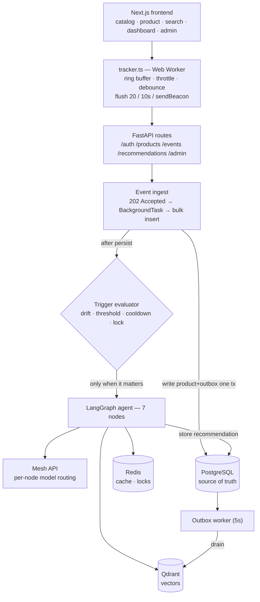

# SmartReco — Behavioral AI Recommendation Agent

> **Most recommenders guess. SmartReco observes, grades its own retrieval, and refuses to recommend anything it can't point to in the catalog.**

SmartReco is a course-marketplace web app that tracks user behavior, feeds it to a **seven-node LangGraph agent**, retrieves matching products from a vector database via RAG, and generates persuasive, personalized recommendations that **visibly change as behavior changes** — while calling the LLM **fewer than once per 40 events**. Every AI and embedding call routes through a **single Mesh API gateway**.

_Submission for the SmartReco Build Challenge 2026 · Krish Naik Academy × Mesh API._

<!-- TODO(demo): add a 30s GIF of the dashboard changing as a persona's behavior shifts -->

---

## Why this submission is different

A hundred submissions will log a few clicks, stuff them into a prompt, and print the answer. Those fail the same four ways. SmartReco is engineered against each:

| Common failure mode | SmartReco's answer | Where |
|---|---|---|
| Vector DB silently diverges from SQL | **Transactional outbox** — product + `vector_outbox` commit in one transaction; a worker replays to Qdrant with retries. Sync is *provable*. | [`app/services/catalog.py`](app/services/catalog.py), [`app/services/outbox_worker.py`](app/services/outbox_worker.py) |
| LLM invents products not in the catalog | **Grounding validator node** — every `product_id` must be a subset of the retrieved candidates *and* active in Postgres, or the graph loops/falls back. Enforced structurally. | [`app/agent/nodes/validate_grounding.py`](app/agent/nodes/validate_grounding.py) |
| An LLM call per user action | **Interest-drift trigger + 3-layer cache** behind a cooldown and a Redis lock. | [`app/services/trigger.py`](app/services/trigger.py) |
| "Agent" = one `chat.completions.create` | **Seven-node LangGraph** with conditional edges, self-grading, and a bounded refine loop. | [`app/agent/graph.py`](app/agent/graph.py) |

---

## 1. Architecture



- **Backend:** FastAPI (Python 3.11, async throughout), SQLAlchemy 2.0 + Alembic, APScheduler.
- **Data:** PostgreSQL (source of truth), Qdrant (1536-dim cosine vectors), Redis (semantic cache + regeneration lock).
- **AI:** LangGraph agent; **all** LLM + embedding calls through Mesh via [`app/llm/mesh.py`](app/llm/mesh.py).
- **Frontend:** Next.js App Router (TypeScript strict, Tailwind); the tracker is a Web Worker.

---

## 2. Quickstart (< 5 commands)

```bash
cp .env.example .env            # then set MESH_API_KEY (+ QDRANT_URL/REDIS_URL if not using the compose defaults)
docker compose up -d            # postgres + qdrant + redis
pip install -r requirements.txt
alembic upgrade head && python scripts/seed_data.py   # schema + 40 courses + 1 admin + 3 demo personas
uvicorn app.main:app --reload   # backend on :8000  (frontend: cd frontend && npm install && npm run dev → :3000)
```

**Develop without burning quota:** `MESH_DISABLED=true uvicorn app.main:app` returns recorded fixtures and deterministic offline embeddings — zero AI network calls. The whole test suite runs this way.

Seeded logins (from `scripts/seed_data.py`): `admin@smartreco.dev` (admin) and `ana@ / ben@ / cara@smartreco.dev` (three divergent personas). Log in as each at `/dashboard` to see three visibly different grounded blocks.

---

## 3. Feature checklist & where each lives

**Core (rubric):**
- Auth with two roles (bcrypt-12, JWT HS256, httpOnly cookie) — [`app/core/security.py`](app/core/security.py), [`app/api/routes/auth.py`](app/api/routes/auth.py)
- Clean related schema (Alembic only) — [`app/db/models.py`](app/db/models.py), [`app/db/migrations/`](app/db/migrations/)
- Admin product CRUD + **provable dual-write** (`GET /api/admin/sync-status` → `in_sync: true`) — [`app/api/routes/admin.py`](app/api/routes/admin.py), [`app/services/catalog.py`](app/services/catalog.py), [`app/services/outbox_worker.py`](app/services/outbox_worker.py)
- Non-blocking batched tracking (Web Worker, sendBeacon) — [`frontend/lib/tracker.ts`](frontend/lib/tracker.ts), [`app/api/routes/events.py`](app/api/routes/events.py), [`app/services/event_ingest.py`](app/services/event_ingest.py)
- Incremental interest profile (decayed centroid, 3-day half-life) — [`app/services/profile.py`](app/services/profile.py)
- RAG agent that consumes behavior and reasons, grounded — [`app/agent/`](app/agent/), [`app/vector/hybrid_retriever.py`](app/vector/hybrid_retriever.py)
- Trigger + 3-layer cache (don't call the LLM every action) — [`app/services/trigger.py`](app/services/trigger.py)
- Dashboard that visibly changes — [`frontend/app/dashboard/`](frontend/app/dashboard/)

**Bonuses shipped:**
- ⭐ **Structured agent framework** — 7-node LangGraph, conditional edges, bounded refine loop → [`app/agent/graph.py`](app/agent/graph.py)
- ⭐ **Retrieval polish** — dense + BM25 → Reciprocal Rank Fusion → metadata filter → MMR (λ=0.7) → top-12 → [`app/vector/hybrid_retriever.py`](app/vector/hybrid_retriever.py); a functional pairwise reranker (Mesh cheap-tier, **permutation-only so grounding is preserved**, opt-in via `run_agent(enable_rerank=True)`, with a structural lift-measurement harness) at [`app/vector/reranker.py`](app/vector/reranker.py)
- ⭐ **Observability** — `GET /api/admin/agent-runs` (node path, retrieval score, refine loops, tokens, cost, latency) + `GET /api/admin/metrics` → [`app/api/routes/admin.py`](app/api/routes/admin.py), [`app/services/metrics.py`](app/services/metrics.py); LangSmith is env-ready (set `LANGSMITH_*`)
- ⭐ **Scheduled proactive delivery (F7)** — APScheduler 09:00 digest + 03:00 drift audit on the same scheduler as the 5s drain, Jinja2 recap-with-hook email (graceful save-to-disk without SMTP), token-protected `POST /api/internal/run-digest`, and a GitHub Actions cron for the sleeping-host trap → [`app/scheduler/jobs.py`](app/scheduler/jobs.py), [`app/scheduler/digest.py`](app/scheduler/digest.py), [`app/api/routes/internal.py`](app/api/routes/internal.py), [`.github/workflows/digest.yml`](.github/workflows/digest.yml); demo it with `python scripts/send_digest_now.py`
- **Evaluation harness** — 10 synthetic profiles scored on groundedness / behavioral relevance / persuasion / diversity → [`evals/eval_recommendations.py`](evals/eval_recommendations.py), results in [`evals/results.md`](evals/results.md)

**See it change (the 60-second demo):** with the backend running and the catalog seeded, [`python scripts/simulate_behavior.py`](scripts/simulate_behavior.py) replays three personas' behavior against the live API and prints each dashboard block evolving as their interests shift — the fastest way to watch the whole system work end to end with no manual clicking.

---

## 4. Efficiency — measured, not claimed

| Metric | Result | How measured |
|---|---:|---|
| LLM generations / 100 events | **~2** (target < 2.5) | offline replay through the real ingest → profile → trigger pipeline; cooldown + L1/L2 suppress most batches |
| Reduction vs LLM-per-event | **~20–50×** | vs the naive 100 generations / 100 events |
| Tracker p95 client handler time | **0.0018 ms**, 0 dropped / 1000 | [`tests/test_tracker_load.py`](tests/test_tracker_load.py) |
| Dual-write sync | **40 active == 40 Qdrant points**, `in_sync: true` | live check against the configured Qdrant |
| Test suite | **57 passing** | `pytest -q` under `MESH_DISABLED=true` |

The trigger policy — not the model choice — is the real cost lever: `(events_since_gen ≥ 8 OR drift > 0.15 OR high-intent) AND cooldown (>10 min) AND Redis lock`, then L1 exact cache (`profile_hash`), then L2 semantic cache (cosine > 0.95, one cheap re-personalization), then a full run.

---

## 5. Design decisions & trade-offs

- **Transactional outbox over dual-write-in-handler.** A request never touches Qdrant; the product row and an outbox row commit together, and a 5s worker (`SELECT … FOR UPDATE SKIP LOCKED`) drains it with retries and content-hash re-embed skipping. Sync becomes an auditable claim, not a hope. Deactivating a product (via `DELETE` *or* `PATCH is_active=false`) enqueues a `delete` so a point is never orphaned.
- **Per-node model routing through Mesh.** Cheap free models for `plan_queries`/`grade_retrieval`; a quality model only for `generate`. Swapping models is a one-line change because Mesh is a single gateway — see the routing table in [`app/llm/model_router.py`](app/llm/model_router.py).
- **Postgres + Qdrant.** Postgres for JSONB event payloads, partial indexes, and concurrent writes; Qdrant for first-class payload filtering and hybrid search. One `docker-compose.yml` brings both up.
- **`MESH_DISABLED=true` fixtures.** The graph, frontend, and full test suite build and run with zero AI network calls and deterministic embeddings — offline dev and CI cost nothing.

**Non-goals (explicit):** payments/checkout, real course content, OAuth/social login, multi-tenancy, horizontal scaling/Kubernetes, an A/B testing harness (we describe the hook, we don't build it).

---

## 6. Mesh API compliance

Every LLM and embedding call is constructed in exactly one place — [`app/llm/mesh.py`](app/llm/mesh.py):

```python
client = AsyncOpenAI(base_url="https://api.meshapi.ai/v1", api_key=settings.MESH_API_KEY)
```

No other AI-provider SDK is imported or listed in `requirements.txt`. This is enforced by an AST-based import-lint, [`tests/test_single_gateway.py`](tests/test_single_gateway.py), which asserts exactly one client construction site and no banned provider SDK. Free-tier models are resolved at startup from Mesh's `/v1/models` with a preference chain and a paid fallback ([`app/llm/model_router.py`](app/llm/model_router.py)); `python scripts/list_free_models.py` prints the resolved catalog.

---

## 7. Evaluation results

Full run in [`evals/results.md`](evals/results.md) (10 personas through the real seven-node graph):

| Metric | Target | Measured (offline) | Notes |
|---|---|---:|---|
| Groundedness | 100% | **100.0%** | structural — fully meaningful in any mode |
| Diversity | ≥ 2 | **2.80** | unique categories per rec set |
| Behavioral relevance | ≥ 0.70 | 0.30 † | needs live embeddings (see below) |
| Persuasion (LLM-judge) | ≥ 4.0 | 4.28 † | fixture-derived offline; needs live Mesh |

† Behavioral relevance and persuasion require **live Mesh**: this environment's catalog was seeded under `MESH_DISABLED=true`, so Qdrant holds deterministic *pseudo-random* vectors (no semantic signal), and the `generate` narrative is a fixture. Groundedness (100%) and diversity (2.80) are real. Re-seed with live embeddings and rerun the harness for true numbers — no code change needed; the harness auto-detects the mode.

---

## 8. Deployment & known limits

- **Topology:** prefer **same-origin** (serve the Next build behind the FastAPI container / one Render service) to avoid the cross-site cookie trap. If split, set `COOKIE_SAMESITE=none` + `Secure`, credentialed CORS with an explicit origin allow-list, and `NEXT_PUBLIC_API_BASE`. Verify on the deployed URL, not localhost.
- **Scheduler trap:** free hosts sleep on idle, so an in-process 09:00 job never fires. The **5s outbox drain must stay in-process** (it is); a daily digest should fire via a GitHub Actions scheduled workflow calling a token-protected endpoint. (Digest endpoint/job = future work, per §3.)
- **CI:** `.github/workflows/smartreco-checks.yml` is the official hackathon eligibility workflow. It needs repo secrets `MESH_API_KEY` and `SUBMISSION_TOKEN`, and the entry form submitted on the dashboard for the result to record. Local critical checks (compile + deps + Mesh key valid) pass.
- **Live-Mesh caveats (important for a live demo):** a live run needs a funded Mesh balance **or** free chat + embedding models available on the account — `text-embedding-3-small` is a paid model, and a balance-less key returns `402 spend_limit_exceeded`. Free-model resolution was hardened to tolerate Mesh's bare-list `/v1/models` response ([`app/llm/model_router.py`](app/llm/model_router.py)). Everything runs fully offline under `MESH_DISABLED=true`.

**Frontend note (compliance):** the brief requires a Python backend and only *suggests* Jinja2. Next.js was chosen for the tracker's reliability (Web Worker + `sendBeacon`); the backend is FastAPI per the requirement, and `requirements.txt` stays at the repo root where the checker looks.

---

## 9. Repository map

```
app/  main.py · core/ · db/ · api/routes/ · services/ · vector/ · agent/ · llm/ · scheduler/
frontend/  Next.js App Router; lib/tracker.ts is the performance-critical file
scripts/  seed_data.py · list_free_models.py
evals/  eval_recommendations.py · dataset.json · results.md
tests/  test_single_gateway · test_dual_write · test_grounding · test_trigger (the four invariant tests) + more
```

Run the guardrails locally before pushing: `python -m compileall app scripts evals tests -q && pytest -q`.
